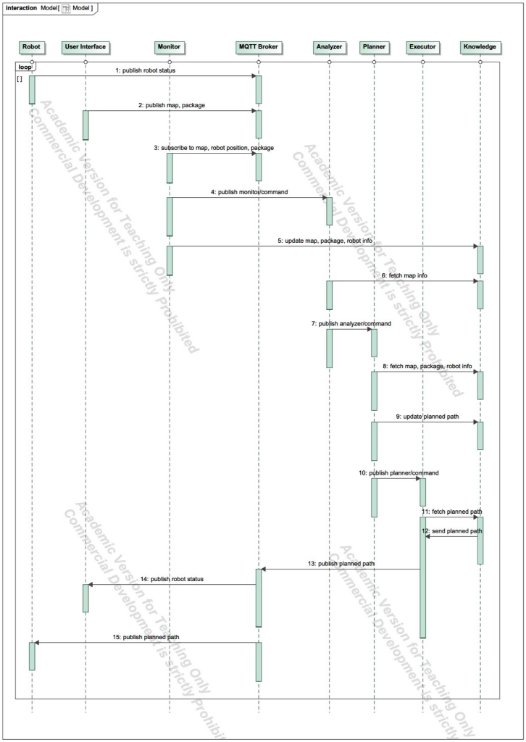
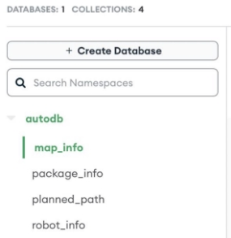
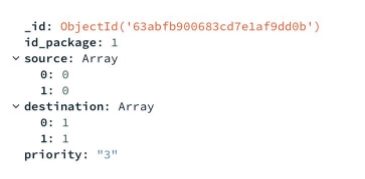

# Autonomous Warehouse Project

[Project GitHub repository](https://github.com/ashish-dahal/autonomous-warehouse)

Table of Contents

[**Project Description**](#project-description)

[**Requirements**](#requirements)
  - [Functional Requirements](#functional-requirements)
  - [Non-functional Requirements](#non-functional-requirements)
  
[**Component Description**](#component-description) 
  - [Component Diagram](#component-diagram)
  - [Sequence Diagram](#sequence-diagram)
  
[**System Implementation**](#system-implementation)
  - [Monitor](#monitor)
  - [Analyzer](#analyzer)
  - [Planner](#planner)
  - [Executor](#executor)
  - [Knowledge](#knowledge)
  - [MongoDB](#mongodb)
  
[Robot](#robot)

[**Technologies**](#technologies)

[**Run the Application**](#run-the-application)

[**Conclusion**](#conclusion)

## Project Description

The autonomous warehouse system would allow the robot to autonomously navigate the warehouse space to retrieve the packages. Packages and obstacles can be added at runtime and the robot would also be able to avoid obstacles along its path while finding the shortest path for package delivery.

The project was implemented in the Python programming language. For communication purposes MQTT broker was used, as well as every component of the system was wrapped in Docker container to ensure ease of moving and maintaining.

The **adaptation goals** of the project as defined:

- Robot should not collide with any obstacles on the way;
- Robot should always choose the shortest path for package delivery;
- The map should recognize the newly placed obstacle and update the map;
- Robot should always choose the priority package in FIFO (First In, First Out) fashion.

The adaptation goals are **supported** by such monitored and analyzed characteristics:

- Package placement, which is available right after the user place the package;
- Obstacles placement, which is available right after the user place the obstacle;
- Is_map_changed characteristic, which is reasoned by logic placed into the Analyzer component. The result of this logic influences if the path for the robot will be recalculated or not.
- Path Planning, which calculates path and avoids obstacles

## Requirements

### Functional Requirements

1. The system should be able to find the shortest path from starting point of the robot to the package destination considering placed obstacles on map
2. The system should be able to adapt the path in case of new obstacles appear on the way and in search of new package  
3. The system should be able to recognize new obstacles added to the map

### Non-functional Requirements

- The system latency should not be more than 0.5 seconds
- The system components should be able to work independently (and scalable)

  
## Component Description

1. **User Interface (Environment)** visualizes the autonomous warehouse. The user would be able to add obstacles and packages through the interface. It also generates a map of the warehouse which acts as an environment. It will be implemented as a web application.
2. **Robot (Managed Element)** gets the planned path from the MQTT broker and moves along the path. It would also publish its current position and state of execution i.e en-route, delivering etc.  
3. **MQTT broker** allows monitor and executor components to communicate with the user interface and robot by providing a publish/subscribe mechanism.
4. **MAPE-K components**  
5. **Monitor** continuously monitors information about the map, the positions of robots, and any actions related to the insertion or deletion of packages. This information is stored in the knowledge base for use by the other components of the system.
6. **Analyzer** analyzes changes in the state of the map and identifies any potential obstacles in the path of the robots and directs planner to execute only when the map changes. 
7. **Planner** plans the shortest path between the source and destination and stores the planned path to the knowledge. However, the path is recalculated only if the state of the map changes.
8. **Executor** gets the planned path from the knowledge and publishes it to the specified MQTT topic.  
9. **Knowledge** provides an interface to store and retrieve map information, package information, robot information and path information to the MAPE-K components.

### Component Diagram

The overall component diagram of the systems can be observed in fig. 1 below.

Fig. 1. Component diagram of the system.

The component diagram above consists of eight components. The five components compose the MAPE-K (Monitor-Analyzer-Planner-Executor with Knowledge) loop, which works together to monitor and improve system performance. The five components of the MAPE-K loop are as follows:

- **Monitor**: The Monitor component subscribes to the MQTT broker to collect data regarding the map, robot position, and package data.
- **Analyzer:** The Analyzer component uses the data gathered by the Monitor component to offer information regarding changes to the map.  
- **Planner:** The Planner component uses information from the Analyzer component to develop a planned path and update the database.
- **Executor:** The executor component implements the plan developed by the Planner.
- **Knowledge:** The knowledge component stores the data about the map, package, robot info, and planned path.
  
In the component diagram of the MAPE-K loop, the five components are interconnected with each other. The remaining three components:
  
- **MQTT Broker:** This component facilitates the exchange of messages between the monitor and executor components, as well as the Robot and User Interface. It receives messages from the monitor component via the "subscribe" connector. It also receives messages from the execute component through the "publish" connector.
- **Robot:** This component is responsible for executing the commands received from the Executor component through the MQTT broker. It also publishes the current position and subscribes to the planned path.  
- **User interface:** The UI component can insert an obstacle or a package. It subscribes to the robot's position data and publishes the map and package data.

  
### Sequence Diagram

Diagram that describes the behavior of the system can be seen in fig. 2.

Fig. 2. Sequence diagram of the system. The operations are performed in the following order:

1. Robot updates MQTT broker with robot status information.  
2. User Interface publishes map and package data to MQTT broker.
3. Monitor
   1. The monitor subscribes to the MQTT broker to obtain information on the robot's position, map, and package.
   2. It publishes the monitor command to the Analyzer. 
   3. The robot's information, map, and package are also updated in Knowledge.
4. Analyzer
   1. Analyzer fetches map info from Knowledge.
   2. It publishes the analyzer command to Planner.
5. Planner
   1. It fetches map, package, and robot info from Knowledge
   2. Then, the planner updates the planned path.
   3. It publishes the planner command to the Executor.
6. Executor
   1. It fetches the planned path from Knowledge, then receives it.
   2. Then, Executor publishes a planned path to MQTT Broker. 
7. MQTT broker
   1. It publishes the robot status to the UI
   2. It publishes a planned path to the Robot.
   

## System Implementation

**Hybrid decentralization pattern** was used for the adaptation control of the system, therefore we distribute the adaptation logic functionality to sub-systems (for example, planner component which adapts the path based on the analyzer output). 

The search-based approach has been employed to develop the decision function of the autonomic manager. The space exploration strategy implemented is A* search.

  
### Monitor

It monitors the MQTT topics for new messages and utilizes them to update a warehouse system's knowledge base. The class establishes a connection to the MQTT broker, subscribes to the four MQTT topics:

- "warehouse/map,"
- "warehouse/robot/status,"  
- "warehouse/package/insert,"
- "warehouse/reset,

Then it uses the appropriate method to update the knowledge base in response to messages received. 

The monitor is launched using **start()** method. It establishes a connection with the MQTT broker and enrolls in the designated topics. When necessary, the **command_analyzer()** method notifies the Analyzer to begin examining the knowledge base. Updates to the knowledge base are made using the insert_map_info(), insert_robot_info(), and **insert_package_info()** methods. The knowledge base is reset using the **reset_knowledge()** method.

The Flask server that manages the knowledge base receives HTTP requests that are sent using the requests module.

### Analyzer

Analyzer class has two methods: get_info() and check_map().

- The map is retrieved from a REST API using the **get_info()** method. The method stores the previous map as self and the current map as self.map. and self.map_temp.
- The **check_map()** method examines any differences between the most recent and earlier maps. It returns True if there has been any change and False otherwise.

  
### Planner

Planner component uses the A* algorithm for finding the shortest path in the map, namely 2D grid. The A* algorithm is a type of best-first search algorithm that uses a heuristic to guide the search of the shortest path.

The path is recalculated only if the map changes, meaning the recalculation decision is based on the output of another component - Analyzer. 

The code defines a Planner class that has the following methods:

- **__init__**: method is used to initialize the class, it takes two parameters *broker_name* and *broker_port* and assigns them to the class variables. It also creates a new instance of the mqtt.Client() class and connects to the MQTT broker using the connect() method.
- **a_star**: method implements the A* algorithm to find the shortest path from a given source to a given destination in a 2D grid. It takes in 3 parameters: *map, source, and destination*. The map is a 2D grid where 0s represent walkable areas for the robot and 1s represent areas with obstacles. The source and destination are tuples that represent the starting and ending positions. 

A_star method first checks if the source or the destination is an obstacle, if it is an obstacle it raises a ValueError. Then, it creates three variables *distances, previous* and *heap* and assigns the initial values to them. Then it enters the main loop, where it repeatedly pops the node with the smallest distance from the heap, and updates the distances and previous nodes of the adjacent nodes if it finds a better path. The loop continues until the destination is reached or the heap is empty. 

If the destination is reached, it returns the shortest path, otherwise, it returns None. Finally, the the mqtt.Client() class is used from the paho-mqtt library to connect to a broker and publish messages.

### Executor

The executor publishes a message to a warehouse/robot/planned_path topic on the MQTT broker and creates a MQTT client. The planned path response is retrieved in JSON format using the execute method of the Executor class, which sends an HTTP GET request to the knowledge to get the planned path. The response is then published to the topic "warehouse/robot/planned_path" by creating a MQTT client, connecting to the broker, and publishing the response. The client is then configured to loop indefinitely so that it can continue to communicate with the broker and process incoming messages.

### Knowledge

For this component the script configures a Flask server to respond to API queries for a robot system. To store and retrieve data, the server is connected to a MongoDB database. However, due to latency issues, another knowledge script was implemented which stores data in variables. The script can be swapped in the docker definition to use MongoDB. Here is a quick rundown of what each route accomplishes:

- GET and POST requests for map information are handled by **/map_info**. The most recent map info document that has been inserted is returned in response to GET requests. A new map info document is inserted into the database in response to a POST request.
- GET, POST, DELETE and PUT requests for package information are handled by **/package_info**. It responds to GET requests by returning the database's first package info document (based on insertion order). A new package info document is inserted into the database in response to a POST request.  
- GET and POST requests for robot information are handled by **/robot_info**. The most recent robot info document that has been inserted is returned in response to GET requests. If a POST request is made, the database is updated with a new robot info page.
- GET and POST requests for planned path data are handled by **/planned_path**. The most current planned path document that has been inserted is returned in response to GET requests. A new planned path document is inserted into the database whenever a POST request is made.

Resetting the knowledge that has been stored in the database is handled by the **/reset** command.

### MongoDB

Fig.3. View from MongoDB Atlas

MongoDB operates on the concepts of collections and documents. A collection is a set of documents. A collection is located inside a single database, with no schema specification required. Documents are in JSON format.

It can be observed from the figure below that this system has one database *autodb* consisting of 4 collections, namely *map_info, package_info, planned_path*, and *robot_info*. 

Fig.4. autodb.package_info document

The PyMongo tool was used to interact with the MongoDB database in Python.

### Robot  

It subscribes to a MQTT broker's planned path topic to get the planned route for delivering packages to a given place. The robot proceeds to the destination after obtaining the intended path by reporting its present state, position, and allocated package to the status topic on the MQTT broker.

These are the methods available to the Robot component:

- Initializes the state, location, and other properties of the robot with __init__().
- When a message is received on the subscribed topic, the callback method **on_message()** is invoked.  
- **path_changed()** is a function that continuously compares the prior and current paths to see whether the path has changed. If the path has, the function invokes **move()**.
- By changing the robot's position and state and publishing the robot's status to the MQTT broker, **move()** advances the robot along the intended path. 
- By generating a JSON object with the robot's state, position, and assigned package, the **publish_status()** function sends the robot's current status to the MQTT broker.
- **start()** is a function that establishes a connection to the MQTT broker, assigns callbacks, and creates a MQTT client.

## Technologies

Several technologies were used in this project including:

- **Docker:** platform that allowes to wrap every component into the container your applications from your infrastructure used for wrapping every component of the project into the container
- **Mosquitto:** a message broker that implements the MQTT protocol versions  
- **Paho MQTT:** extremely lightweight publish/subscribe messaging transport
- **mongoDB:** non-relational document database that provides support for JSON-like storage.

1. Python: an interpreted, object-oriented, high-level programming language

with dynamic semantics. 

## Run the Application

**To run the warehouse application**:

1. From the root of the project, run ***docker-compose build***  
2. run ***docker-compose up***
3. From the browser, go to ***localhost:8080***

The message exchanges and component status' can be observed on the console of the GUI and Docker.

**Known bugs and limitations:** 

The app satisfies the requirements defined above, however there are some known bugs and limitations as follows that is needed to be kept in mind while running the application:

1. The obstacles can only be inserted when the robot has not picked up the package.  
2. Additional packages cannot be inserted while the robot has not completed delivering the packages. 
3. Using the reset button causes robot to replicate, use the browser refresh button instead.
4. Docker container needs to be re-run if any other runtime bugs appear

## Conclusion

During this project functional and non-functional requirements for the Autonomous Warehouse system were defined, alongside with architecture of the system, using MAPE-K feedback loop. All components were defined as well as relationships between them in the component diagram, the sequence diagram in turn shows a typical workflow of the designed system. 

The system was successfully implemented and the demo was performed. All the requirements defined previously were met.